```{r setup, include=FALSE}
options(htmltools.dir.version = FALSE)
knitr::opts_chunk$set(message = FALSE, 
                      echo = FALSE, 
                      warning = FALSE,
                      fig.align = "center")
```

```{r xaringan-themer, include=FALSE, warning=FALSE}
library(xaringanthemer)
style_duo_accent(
  primary_color = "#9F999C",
  secondary_color = "#FFE5F3",
  inverse_header_color = "#8F8C8E",
  link_color = "deeppink",
  title_slide_text_color = "#3d3d3d",
  title_slide_background_image = "img/title-slide-background-light.png",
  title_slide_background_position = "left",
  header_font_google = google_font("Josefin Sans"),
  text_font_google   = google_font("Montserrat", "300", "300i"),
  code_font_google   = google_font("Fira Mono")
)
```

```{css, echo = FALSE}
# source: https://community.rstudio.com/t/using-multiple-font-sizes-for-code-chunks/26405/6
.remark-slide-content {
  font-size: 20px;
  padding: 20px 80px 20px 80px;
}
.remark-code, .remark-inline-code {
  background: #f0f0f0;
}
.remark-code {
  font-size: 24px;
}
.huge .remark-code { /*Change made here*/
  font-size: 200% !important;
}
.small .remark-code { /*Change made here*/
  font-size: 80% !important;
}
.tiny .remark-code { /*Change made here*/
  font-size: 60% !important;
}
```


### 1. Teach R by doing data analysis

**What?** In your first lesson, load the data, do some "mild" wrangling and make a plot!

**Why?** Motivation!

***

.pull-left[
.tiny[
```r
library(tidyverse)

# load the data set
can_lang <- read_csv("data/can_lang.csv")

# obtain the 10 most common Aboriginal languages
aboriginal_lang <- filter(can_lang, 
                          category == "Aboriginal languages")
arranged_lang <- arrange(aboriginal_lang, 
                         by = desc(mother_tongue))
ten_lang <- slice(arranged_lang, 1:10)

# create the visualization
ggplot(ten_lang, aes(x = mother_tongue,
                     y = reorder(language, mother_tongue))) +
  geom_bar(stat = "identity") +
  xlab("Mother Tongue (Number of Canadian Residents)") +
  ylab("Language") 
```
]
]

.pull-right[
```{r nachos-to-cheesecake-1, out.width="100%", fig.align="left", fig.retina=2}
knitr::include_graphics("img/nachos-to-cheesecake-1.png")
```
]

Source: 
[Chapter 1 of *Data Science: A First Introduction*](https://datasciencebook.ca/intro.html) 
by Tiffany Timbers, Trevor Campbell & Melissa Lee

---

<!---Teaching the tidyverse can facilitate this:--->

.pull-left[
<blockquote class="twitter-tweet" data-lang="en"><p lang="en" dir="ltr">When you start writing a loop then turn it into dplyr <a href="https://twitter.com/hashtag/rstats?src=hash&amp;ref_src=twsrc%5Etfw">#rstats</a>; David Robinson (@drob) <a href="https://twitter.com/drob/status/701790246111825925">Feb 22, 2016</a></blockquote>
<script async src="https://platform.twitter.com/widgets.js" charset="utf-8"></script>
]

.pull-right[
```{r jenny-teach-tidyverse}
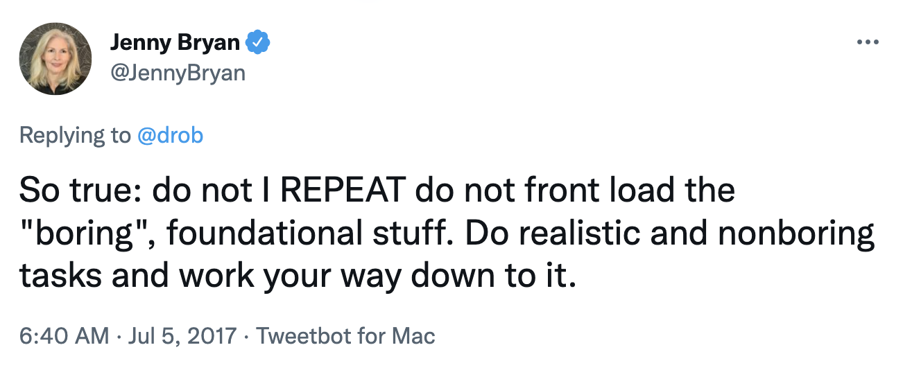
```

#### Explore more:
David Robinson:
- [Teach the tidyverse to beginners](http://varianceexplained.org/r/teach-tidyverse/)
blog post
- [Announcing "Introduction to the Tidyverse", my new DataCamp course](http://varianceexplained.org/r/intro-tidyverse/) blog post
- [Introduction to the Tidyverse](https://www.datacamp.com/courses/introduction-to-the-tidyverse) online course
]
---

### 2. Use participatory live coding!

**What?** Narrate and type out the code you are teaching. Have participants follow along.

**Why?** Demonstrates process and makes you appear human!

***

```{r lex-live-coding, out.width="70%", fig.retina=2, fig.align="left"}
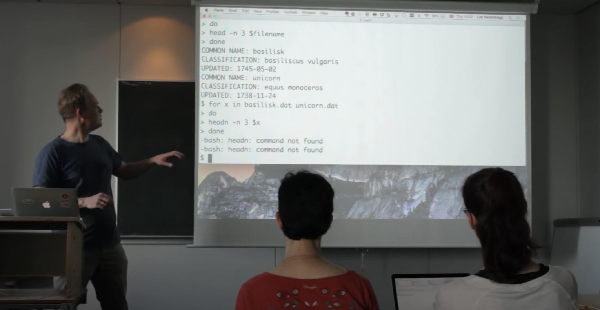
```

Source: [A video introduction to live coding part 2](https://www.youtube.com/watch?v=SkPmwe_WjeY&t=111s) by Lex Nederbragt

---

```{r carpentries, out.width="70%", fig.retina=2}

```

#### Explore more:
- [Ten quick tips for teaching with participatory
live coding](https://doi.org/10.1371/journal.pcbi.1008090) by Lex Nederbragt, Rayna Harris, Alison Hill & Greg Wilson
- [Live coding section of Teaching Tech Together](https://teachtogether.tech/en/index.html#s:performance-live) by Greg Wilson
- Example live coding videos by Lex Nederbragt ([bad example](https://www.youtube.com/watch?v=bXxBeNkKmJE&t=5s), [good example](https://www.youtube.com/watch?v=SkPmwe_WjeY&t=111s))
---

### 3. Give tons and tons of practice!

**What?** Give the learners many many problems to solve.

**Why?** Repetition leads to learning!

***

Read the data files listed in the table below and and bind the names listed in the table to them.

| File  | Object name to bind to the data frame | File location |
|---|---|----|
| `abbotsford_lang.xlsx`  | `abbotsford` | `data` directory of this repo |
| `calgary_lang.csv`  | `calgary`  | `data` directory of this repo |
| `edmonton_lang.xlsx`  | `edmonton`  | https://github.com/ttimbers/canlang/tree/master/inst/extdata |
|  `kelowna_lang.csv` | `kelowna`  | `data` directory of this repo |
| `vancouver_lang.csv`  | `vancouver`  | `data` directory of this repo |
| `victoria_lang.csv`  | `victoria`  | https://github.com/ttimbers/canlang/tree/master/inst/extdata |

---

.pull-left[
```{r swirl, out.width="30%", fig.retina=2}
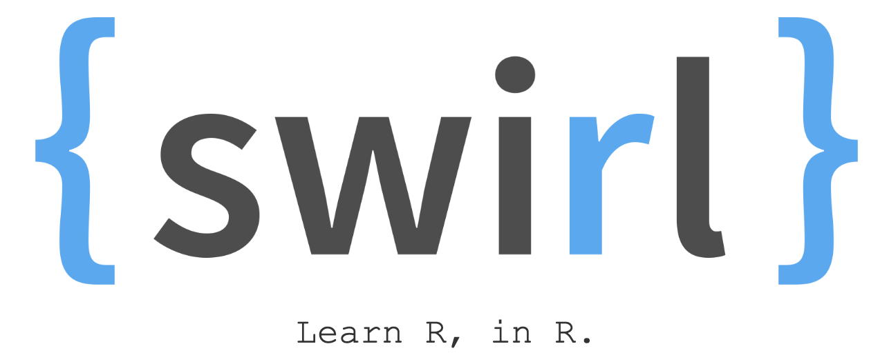
```

```{r swirl-demo, out.width="90%", fig.retina=2}
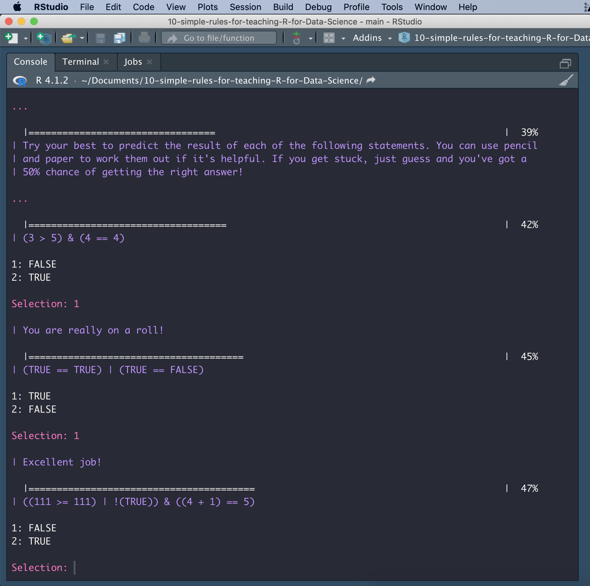
```
]

.pull-right[
#### Explore more:
- [Swirl R package](https://swirlstats.com/) by Sean Kross and others
- [Practice worksheets to accompany Data Science: A First Introduction](https://github.com/UBC-DSCI/data-science-a-first-intro-worksheets#readme) by Tiffany Timbers, Trevor Campbell and Melissa Lee
- [Supervised Machine Learning Case Studies in R course](https://supervised-ml-course.netlify.app) by Julia Silge
- [Coding exercise types in Teaching Tech Together](https://teachtogether.tech/en/index.html#s:exercises) by Greg Wilson
]

---

### 4. Give tons and tons of timely feedback!

**What?** Automated software tests to give hints and feedback.

**Why?** Effective practice requires feedback!

***

```{r tests-as-feedback, out.width="70%", fig.retina=2, fig.align="left"}
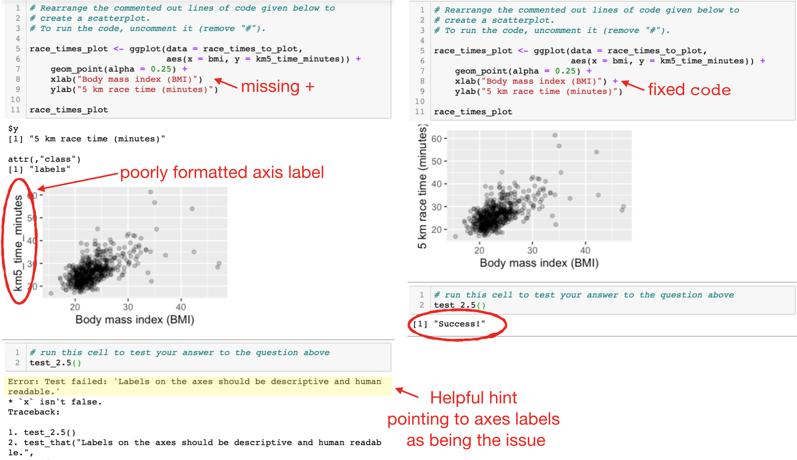
```

---

.pull-left[
```{r teaching-tech-together, out.width="75%", fig.retina=2}
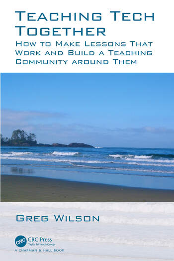
```
]

.pull-right[
#### Explore more:
- [Automatic Grading chapter of *Teaching Tech Together*](https://teachtogether.tech/en/index.html#s:exercises-grading) by Greg Wilson
- [learnr](https://rstudio.github.io/learnr/) R package for automated feedback of R Markdown documents
- [nbgrader](https://nbgrader.readthedocs.io/en/stable/) tool for automated feedback & autograding of Jupyter notebooks
- [ottergrader](https://otter-grader.readthedocs.io/en/latest/) tool for automated feedback & autograding of both Jupyter notebooks & R Markdown documents
]

---

## 5. Use tractable or toy data examples

**What?** Use a countable number of things when teaching a new tool, method or algorithm.

**Why?** Allows one to see how all the elements are manipulated.

***

A small subset of the `palmerpengiuns` data set for teaching K-means clustering:

```{r 10-toy-example-clustering-1, out.width="35%", fig.retina=2}
knitr::include_graphics("img/10-toy-example-clustering-1.png")
```

Source: [Clustering chapter of *Data Science: A First Introduction*](https://datasciencebook.ca/clustering.html) by Tiffany Timbers, Trevor Campbell & Melissa Lee

---

.pull-left[

```{r jenny-dplyr-join-tweet, out.width="100%", fig.retina=2}
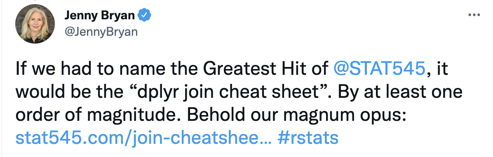
```

.small[
```r
left_join(superheroes, publishers)
```
]

We basically get `x = superheroes` back, but with the addition of variable `yr_founded`, which is unique to `y = publishers`. Hellboy, whose publisher does not appear in `y = publishers`, has an `NA` for `yr_founded`.

```{r jenny-bryan-left-join, out.width="100%", fig.retina=2}
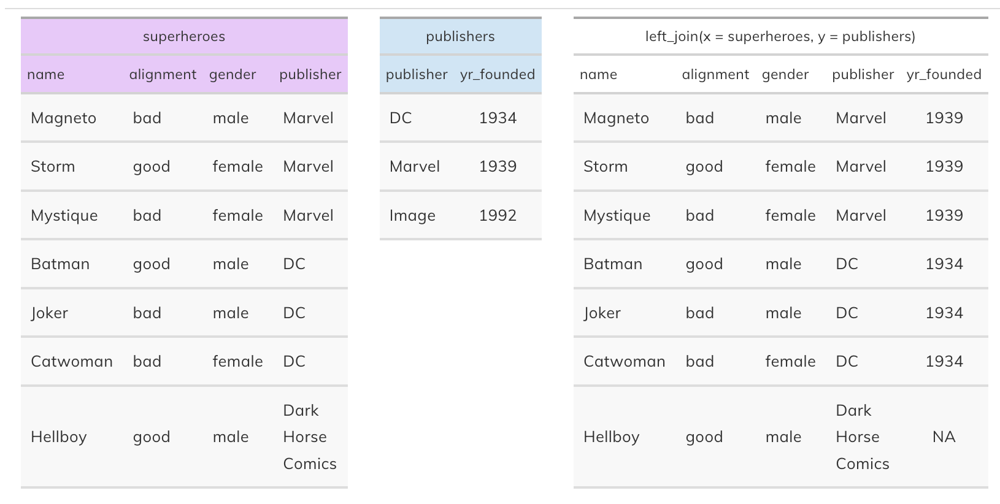
```
]

.pull-right[
#### Explore more:
- [Jenny Bryan's join cheat sheet](https://stat545.com/join-cheatsheet.html)
- [`dpylr::tibble`](https://tibble.tidyverse.org/reference/tibble.html) or [`dpylr::tribble`](https://tibble.tidyverse.org/reference/tribble.html) R functions
- [`sample`](https://www.rdocumentation.org/packages/base/versions/3.6.2/topics/sample) or [`dpylr::sample_n`](https://dplyr.tidyverse.org/reference/sample_n.html) R functions
- [charlatan](https://docs.ropensci.org/charlatan/) R package for creating fake data
- [drawdata.xyz](https://drawdata.xyz/) app to draw a data set and download it
]
---

## 6. Use real and rich, but accessible, data sets

**What?** Use real and interesting data that is also easily understood by all.

**Why?** Motivating! 

***

```{r README-example-plot-from-data-1, out.width="70%", fig.retina=2, fig.align="left"}
knitr::include_graphics("img/README-example-plot-from-data-1.png")
```

Source: [`canlang`](https://ttimbers.github.io/canlang/) R package
---
.pull-left[
Jenny Bryan's [`gapminder`](https://github.com/jennybc/gapminder) R data package:

| variable  | meaning                  |
| :-------- | :----------------------- |
| country   |                          |
| continent |                          |
| year      |                          |
| lifeExp   | life expectancy at birth |
| pop       | total population         |
| gdpPercap | per-capita GDP           |
]

.pull-right[
```{r gapminder, fig.height=5}
# source: https://github.com/jennybc/gapminder
# for convenience, integrate the country colors into the data.frame
library(gapminder)
library("ggplot2")

ggplot(subset(gapminder, continent != "Oceania"),
       aes(x = year, y = lifeExp, group = country, color = country)) +
  geom_line(lwd = 1, show.legend = FALSE) + facet_wrap(~ continent) +
  scale_color_manual(values = country_colors) +
  theme_bw() + theme(strip.text = element_text(size = rel(1.1))) +
  labs(x = "Year",
       y = "Life Expectancy (years)")
```
]

#### Explore more:
- [`canlang`](https://ttimbers.github.io/canlang/) R data package 
- [`palmerpenguins`](https://allisonhorst.github.io/palmerpenguins/) R data package
- [`Lahman`](https://github.com/cdalzell/Lahman) baseball R data package
- [`datateachr`](https://github.com/UBC-MDS/datateachr) R data package
- [`taxyvr`](https://github.com/UBC-MDS/taxyvr) R data package
- [UCI Machine Learning Repository](https://archive-beta.ics.uci.edu/) for data sets

---

## 7. Provide cultural and historical context

**What?** When R things seem "odd", take time to explain why they are the way they are.

**Why?** Cultivates an appreciation, or at least understanding of R's quirks (compared to other programming languages). Helps prevent frustration and/or annoyances. Helps with motivation again!

***

When teaching programming with the `tidyverse`, 
I make sure to introduce R's history and it's design purpose, 
so that the role and rationale for unquoted column names is clear:

>#### Now, a bit of history about R
>- An implementation of the S programming language (created at Bell labs in 1976)
>- written in C, Fortran, and R itself
>- R was created by Ross Ihaka and Robert Gentleman (Statisticians from NZ)
>- R is named partly after the authors and partly as a play on the name of S
>- First stable beta version in 2000

---

.pull-left[
```{r why-assignment-1, out.width="100%", fig.retina=2}
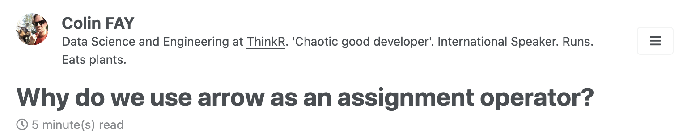
```

(Or why `<-` instead of `=`?)

```{r why-assignment-2, out.width="100%", fig.retina=2}
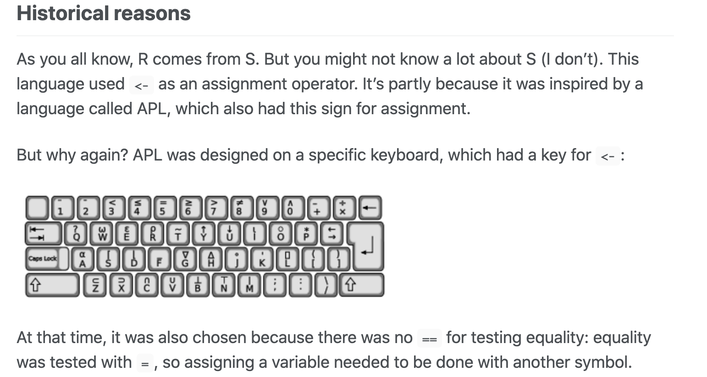
```

Source: https://colinfay.me/r-assignment/
]

.pull-right[

#### Explore more:
- [History and Overview of R chapter](https://bookdown.org/rdpeng/rprogdatascience/history-and-overview-of-r.html) from R Programming for Data Science by Roger Peng
- [Introduction to *R for Data Engineers*](https://tidynomicon.github.io/tidynomicon/) by Greg Wilson
- [Wikipedia article on R](https://en.wikipedia.org/wiki/R_(programming_language)
]
---

## 8. Build a safe, inclusive and welcoming community

**What?** Put in place scaffolding and guidelines to facilitate a safe learning environment.

**Why?** Students cannot effectively learn if they do not feel safe.

***

```{r dsci-100-coc, out.width="75%", fig.retina=2, fig.align="left"}
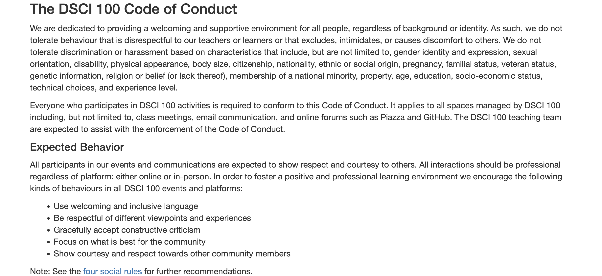
```

Source: https://ubc-dsci.github.io/dsci-100-student/CODE_OF_CONDUCT.html
---

```{r carpentries-coc, out.width="100%", fig.retina=2}
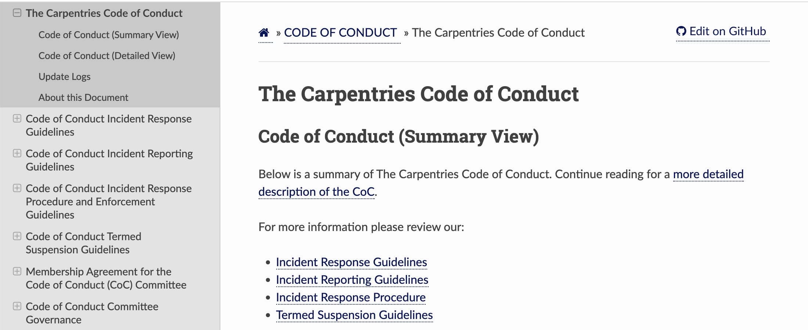
```

Source: https://docs.carpentries.org/topic_folders/policies/code-of-conduct.html

#### Explore more:
- [Ally Skills workshop](https://frameshiftconsulting.com/ally-skills-workshop/)

---

### 9. Use checklists to focus and facilitate peer learning

**What?** Focus and provide structure to student peer review by providing them review checklists.

**Why?** Peer review is hard and often new to many. Also reviewing something you are new at is even harder! What to focus on?

***

##### Data analysis review checklist:

.pull-left[
```{r da-review-checklist-1, out.width="85%", fig.retina=2}
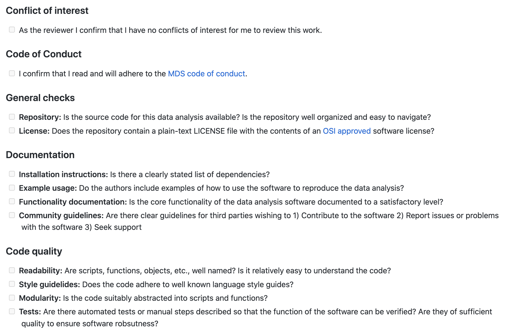
```
]

.pull-right[
```{r da-review-checklist-2, out.width="85%", fig.retina=2}
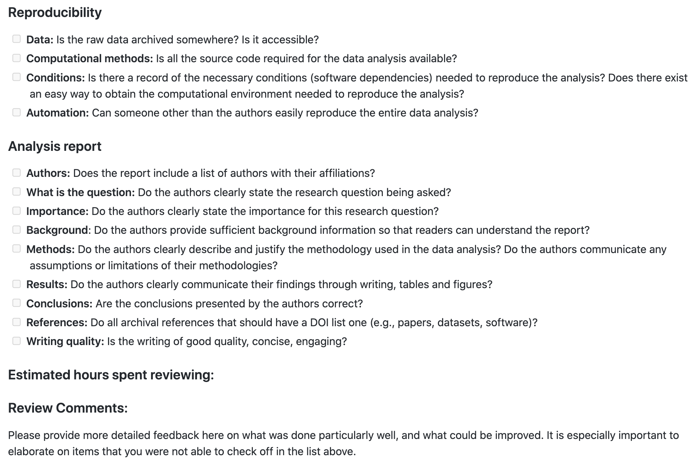
```
]

Source: https://github.com/UBC-MDS/data-analysis-review-checklist
---

#### ROpenSci R package reviews utilize checklists:

.pull-left[
```{r ropensci-1, out.width="80%", fig.retina=2}
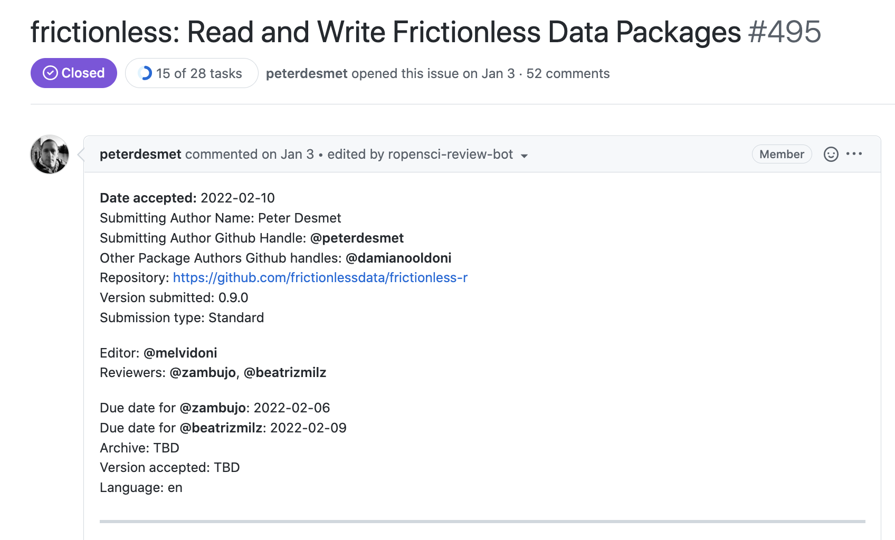
```
]

.pull-right[
```{r ropensci-2, out.width="80%", fig.retina=2}
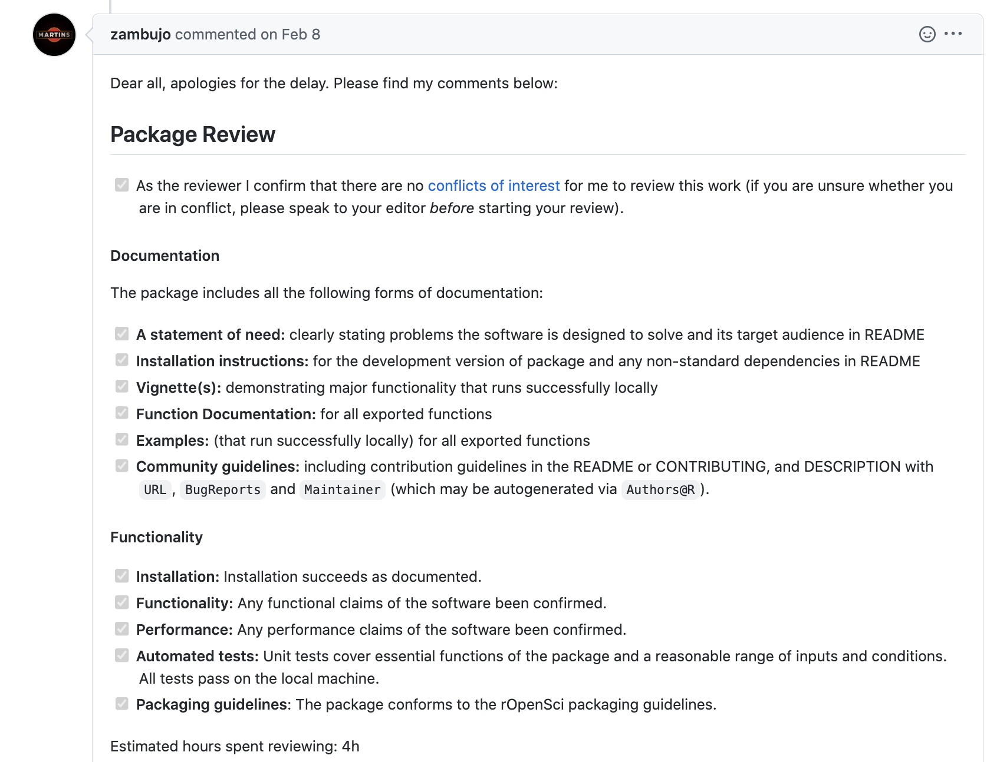
```
]

Source: https://github.com/ropensci/software-review/issues/495

#### Explore more:
- [Using rOpenSci Software Peer Review Guidelines for Teaching](https://ropensci.org/blog/2019/08/27/software-peer-review-guidelines-for-teaching/) blog post by Tiffany Timbers
- [ROpenSci review template](https://devguide.ropensci.org/reviewtemplate.html)
- [Journal of Open Source Software review checklist](https://joss.readthedocs.io/en/latest/review_checklist.html)
- [Machine Learning Reproducibility Checklist](https://www.cs.mcgill.ca/~jpineau/ReproducibilityChecklist.pdf) by Joelle Pineau
- [ Checklist Manifesto](http://atulgawande.com/book/the-checklist-manifesto/) by Atul Gawande

---

## 10. Have students do projects

**What?** Have students perform a (scoped) data analysis project on a topic of their choosing.

**Why?** Motivation and exposure to the messiness of real data analysis.

***

Student project from DSCI 524 (Collborative Software Development):

```{r student-project, out.width="90%", fig.reztina=2, fig.align="left"}
knitr::include_graphics("img/student-project.png")
```

Source: https://github.com/UBC-MDS/rlyrics

---

Projects are central to UBC's founding data science course, STAT 545 (created by Jenny Bryan).

```{r stat-545, out.width="60%", fig.retina=2, fig.align="left"}
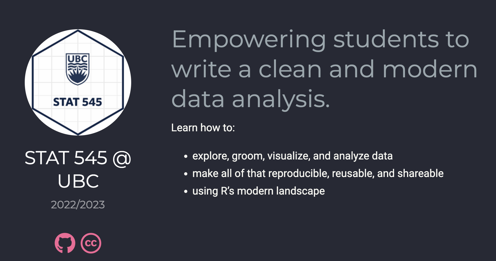
```

Source: https://stat545.stat.ubc.ca/

#### Explore more:

- [Project courses in MDS](https://ubc-mds.github.io/2019-08-22-project-courses/) blog post by Tiffany Timbers and Mike Gelbart
- [Project-based learning: A review of the literature](https://doi.org/10.1177/1365480216659733) by Dimitra Kokotsaki, Victoria Menzies and Andy Wiggins

---

## 10 simple rules for teaching R for Data Science

--

1. Teach R by doing data analysis

--

2. Use participatory live coding

--

3. Give tons and tons of practice

--

4. Give tons and tons of feedback

--

5. Use tractable or toy data examples

--

6. Use real and rich, but accessible, data sets

--

7. Provide cultural and historical context

--

8. Build a safe, inclusive and welcoming community

--

9. Use checklists to focus and facilitate peer learning

--

10. Have students do projects

---


### Acknowledgements


- UBC Master of Data Science students

- UBC DSCI 100 and 310 students

- [UBC Master of Data Science teaching team](https://ubc-mds.github.io/team/) and the DSCI 100 teaching team

- [The Carpentries](https://carpentries.org/)

- [Greg Wilson](https://third-bit.com/), Software Engineer, Deep Genomics

- [Jenny Bryan](https://jennybryan.org/), Software Engineer, Posit

- [David Robinson](http://varianceexplained.org/), Director of Data Scientist, Heap

- [Roger Peng](https://rdpeng.org/), Professor of Statistics and Data Sciences , University of Texas, Austin

- [Lex Nederbragt](https://lexnederbragt.com/), Senior Lecturer, University of Oslo

- [Sean Kross](https://seankross.com/), Data Staff Scientist, Fred Hutch Data Science Lab

- [Colin Fay](https://colinfay.me/), Data Scientist & R Hacker, ThinkR

- And many more educators in the R community!!! There are too many to list!

---


class: inverse, center, middle

## 10 simple rules for teaching R for Data Science

#### talk slides: *[https://bit.ly/timbers-cascadia-r-conf-2022](https://bit.ly/timbers-cascadia-r-conf-2022)*
